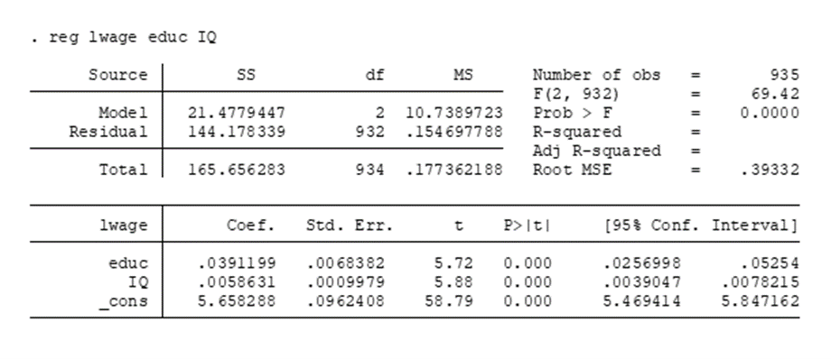
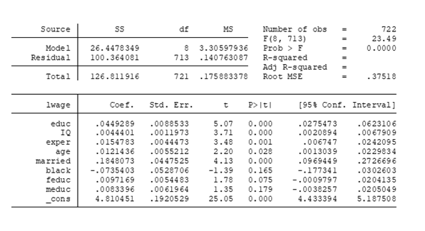

```{r setup, include=FALSE}
knitr::opts_chunk$set(echo = TRUE)
```

**Entregable**: Un archivo de Word o PDF (e.g. LaTex, R-Markdown) contestando correctamente a las preguntas abajo presentadas y grabado con su nombre, así como el archivo “Script” de R.

## 1. Griliches (1977) en una investigación muy influyente intenta determinar los “Retornos a la educación” en EE. UU. Es decir, cuánto contribuye un año más de educación formal al sueldo en dólares.

Algunas de las variables que utilizó son las siguientes:

| Nombre de la variable |                                                                           |
|-------------------------|-----------------------------------------------|
| *wage*                | Sueldo mensual en dólares.                                                |
| *lwage*               | Logaritmo del sueldo mensual en dólares.                                  |
| *educ*                | Años de educación.                                                        |
| *exper*               | Años de experiencia laboral.                                              |
| *IQ*                  | Coeficiente intelectual en puntos (Media de 100 puntos, DS de 15 puntos). |
| *age*                 | Edad del individuo en años.                                               |
| *Married = 1*         | Si se encuentra casado.                                                   |
| *Black = 1*           | Si el individuo es de raza negra.                                         |
| *meduc*               | Educación de la madre en años.                                            |
| *Feduc*               | Educación del padre en años.                                              |

El autor, primero obtiene la siguiente regresión:


a.  Interprete el coeficiente de *educ*.
b.  Interprete el coeficiente ajustado de determinación ($R^2$ ajustada).
c.  Interprete la constante en el modelo.

Posteriormente, el autor estima la siguiente regresión:



d.  Interprete el coeficiente de *IQ.*
e.  ¿En cuánto aumenta el ingreso promedio si el *IQ* aumenta en una Desviación Estándar (DS)?
f.  Demuestre formalmente/matemáticamente, por qué el coeficiente de *educ* es menor que el obtenido en la primera regresión.

Ahora se presenta el modelo integrando todas las variables explicativas.

\

i\. ¿Es este modelo mejor describiendo la variación en sueldos que el modelo anterior? Estime manualmente $R^2$ ajustada en ambos modelos.

ii\. Interprete el coeficiente de *exper* ¿Es posible saber si el sesgo en *educ* por omisión de *exper* es “hacia arriba” o “hacia abajo” con los resultados de esta regresión? ¿Muéstrelo formalmente?

iii\. Explique, intuitivamente, por qué al autor le interesaría controlar por la educación de los padres del individuo *i*?


[//]: # ## 2. **¿Cuáles son los supuestos clásicos SLR y MLR analizados hasta el momento?** Escríbalos formalmente y descríbalos brevemente con palabras.

## 2. Copie el siguiente Código en R:

```{r, echo=TRUE, eval=FALSE}

#Clear the environment
rm(list = ls())

library(tidyverse)

#help
help(rnorm)

#Lets create some variables!
set.seed(1234567) #good practice for when working with random vars (reproducibility)

x <- rnorm(1000) #1000 random obs
y <- matrix((5000 + 100*x) + rnorm(1000 * 500, mean=0, sd=1), ncol = 500) #Y = bo + b1x + u 
y <- data.frame(y)

#this loop renames i column names of Y matrix
for (i in 1:ncol(y)){
  colnames(y)[i] <- paste0("y",i) 
}

#Run 500 regressions!
betas <- 1:500 #create an empty object with 500 entries to be filled with the B1s

for (i in 1:ncol(y)){    #This loop runs 500 regressions Yi on X for i=1 to 500
  betas[i] <- summary(
  lm(y[,i]~x))$coefficients[2,1] 
  #extracts the coefficient beta 1 from the matrix of results provided by R
}

```

a.  Pega la media de todas las $\beta_1$ estimadas

b.  Pega el histograma de las $\beta_1$ estimadas

c.  El Teorema de Gauss-Markov establece que, bajo los supuestos clásicos, el estimador MCO es BLUE (Best Linear Unbiased Estimator/ Mejor Estimador Lineal Insesgado). ¿Sugieren los estadísticos de resumen y el histograma de las partes a. y b. que el estimador MCO es insesgado? Explique por qué.

d.  Explique qué partes del código anterior garantizan que se cumplan los supuestos de Gauss-Markov.

## 3. Utilice el código siguiente y cambie el número de observaciones de 100, a 10.000 y a 100.000.

```{r, echo=TRUE, eval=FALSE}

set.seed(1234567)
x <- rnorm(100) #100 random obs
resid <- rnorm(100, mean=0, sd=10) #random error
y <- (20 + 2*x + resid)
model <-  lm (y ~ x)
summary(model)

```

a.  Muestre los tres resultados. 
b.  Explique por qué, formalmente, (¡utilice una fórmula!) el error estándar de *beta* converge a cero cuando n tiende a infinito.
c.  Transforme el código anterior para mostrar que una mayor varianza de x reduce el error estándar de *beta*.
d.  Por construcción, en el código anterior el residuo está centrado alrededor de cero. Cambiemos esto artificialmente. Mantenga n=100 y cambie el término residual en el código anterior a una media de 20. ¿Cuál es la constante ahora? ¿Está sesgada $\hat{\beta_1}$?
e.  Dibuja un diagrama de dispersión (con una línea ajustada) para las regresiones de la parte 3.a. (n=100) y de la parte 3.d. ¿Cuáles son sus conclusiones sobre la estimación de $\beta_1$?

## 4. Ejecute el siguiente código:

```{r, echo=TRUE, eval=FALSE}

#Clear the environment
rm(list = ls())

repet <- 1000
n <- 1000
beta <- NULL

set.seed(1234567)

for (i in 1:repet){
  x1 <- rnorm(n, mean=50, sd=10) 
  x2 <- (rnorm(n, mean=5, sd=30)+.1*x1)  
  u <- (rnorm(n, mean=0, sd=1)) 
  y=2+2*x1+10*x2+u # we define y, so that beta1=2 and beta2=10.
  beta[i] <- lm(y~x1)$coef[2] 
  }
  
hist(beta, main="suit yourself, n=1000", xlim = c(0,8) ) 
abline(v = mean(beta), col="red", lwd=3, lty=2 )
abline(v = 2, col="blue", lwd=3, lty=2)

```

a.  Ligue las líneas de código que considere relevantes con los supuestos MLR pertinentes. ¿Se cumple MLR4?

b. Describa el supuesto clave que se está analizando y demuestre mediante el uso de alguna fórmula cómo afecta la estimación de $\hat\beta_1$ y $\hat\beta_2$

c.  Modifique el código arriba para estimar $\hat\beta_1$ de una manera más *precisa.*

## 5. Wooldridge Data en R.

a.  Utilice la base de datos "*bwght*". Obtenga la regresión de *birth weight* (peso al nacer) en onzas sobre el consumo de cigarrillos al día. Utilice como controles *log(cigprice)* y *mothereduc*. Interprete los coeficientes $\beta_0$ y $\beta_1$.

b.  Ejecute la misma regresión utilizando el logaritmo del peso al nacer como dependiente. Interprete los coeficientes $\beta_0$ y $\beta_1$.


## Ejercicios Opcionales:

## 1 Bis) Resuelva los ejercicios 7 y 16 correspondientes al capítulo 2 de Wooldridge ed. 7.

## 2 Bis) Demuestre matemáticamente lo siguiente:
a.  Que en un modelo Log – Level: **%**$\Delta$**Y=**$\Delta$**X(**$\beta_1*100$**)**\
b.  Que un modelo Level – Log: $\Delta$**Y=%**$\Delta$**X(**$\beta_1/100$**)**
